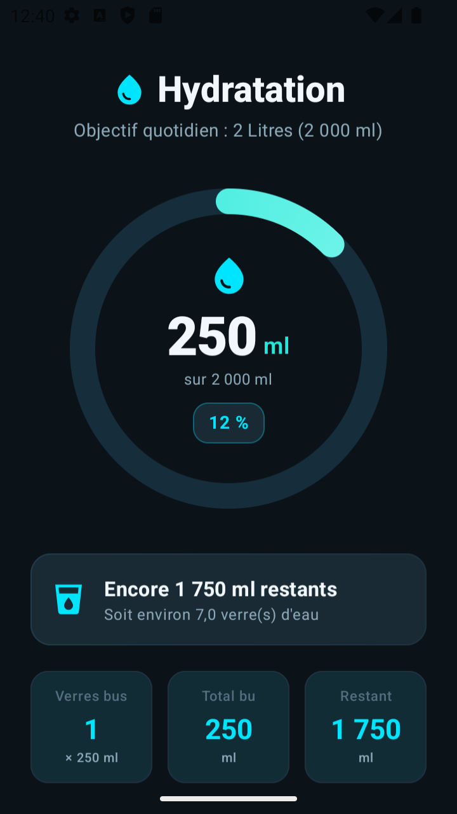

# Mise en fonctionnement locale de HydrationTracker

Rapport des corrections et de validation — 14 septembre 2026

Auteur: Yeo Germain

## Résultat obtenu

Le projet compile sur le PC avec Android Studio Meerkat Feature Drop 2024.3.2, conformément à la version imposée. L’application a été installée et lancée depuis Android Studio sur l’émulateur Small Phone API 33 sous Android 13. Les sept tests automatisés passent. Android Lint ne signale aucune erreur bloquante et conserve 37 avertissements.

Ce document présente le diagnostic, toutes les corrections de configuration réalisées, leur justification, les commandes de reproduction et les preuves de vérification. La version de publication signée release n’a pas été construite.

## Application réalisée

Hydratation suit la consommation d’eau vers un objectif fixe de 2 000 ml. L’interface en français affiche une jauge animée, le pourcentage, le total bu, le volume restant et le nombre de verres de 250 ml.

- Ajout de 250 ml, avec raccourcis de 100 ml et 500 ml.

- Retrait de 250 ml sans total négatif et remise à zéro après confirmation.

- Message lorsque l’objectif est atteint et interface sombre défilante.

Les données restent en mémoire dans le ViewModel. Il n’existe pas de sauvegarde durable des consommations ni de remise à zéro automatique à minuit. L’objectif n’est pas personnalisable dans l’interface.

## Environnement conservé

Windows 11 ; Android Studio 2024.3.2 ; JBR 21.0.6 ; AGP 8.10.1 ; Gradle 8.11.1 ; Kotlin 2.2.10 ; Compose BOM 2024.09.00 ; Core KTX 1.16.0.

SDK de compilation et cible : API 36. SDK minimal : API 24. Build Tools par défaut d’AGP 8.10 : 35.0.0. Cible du bytecode Java et Kotlin : JVM 11, distincte du JDK qui exécute Gradle.

## Diagnostic et corrections de compatibilité

### Incompatibilité avec Android Studio

Les logs du 14 septembre, à 11 h 14 puis à 11 h 15, montrent un échec de synchronisation : le projet demande AGP 9.1.1 alors que l’installation accepte au maximum AGP 8.10.1. Les anciens messages concernant GreetingCard, l’indexation ou ADB ne constituent pas des erreurs de compilation confirmées de HydrationTracker.

```text
The project is using an incompatible version (AGP 9.1.1)
Latest supported version is AGP 8.10.1
```

### Alignement de AGP et Gradle

Dans gradle/libs.versions.toml, agp passe de 9.1.1 à 8.10.1. Dans gradle/wrapper/gradle-wrapper.properties, la distribution passe de Gradle 9.3.1 à Gradle 8.11.1. Cela adapte le projet à Android Studio sans remplacer le logiciel imposé.

### Adaptation du SDK et de Core KTX

Dans app/build.gradle.kts, la déclaration compileSdk avec release(36) et minorApiLevel = 1 est remplacée par compileSdk = 36. targetSdk reste à 36 et minSdk à 24. Le SDK 36.1 exige une chaîne plus récente ; AGP 8.10 prend en charge l’API 36. Core KTX passe de 1.18.0 à 1.16.0 dans le catalogue des versions pour accompagner la remise en compatibilité.

### Déclaration explicite du plugin Kotlin Android

AGP 9 intègre Kotlin ; AGP 8 exige le plugin Android Kotlin explicite. L’alias kotlin-android, lié à org.jetbrains.kotlin.android et à la version kotlin, est ajouté dans le catalogue. Il est déclaré avec apply false dans le build.gradle.kts principal, puis appliqué dans le module app. Le plugin Compose est conservé.

```text
kotlin-android = { id = "org.jetbrains.kotlin.android",
  version.ref = "kotlin" }
```

compilerOptions.jvmTarget est fixé à JvmTarget.JVM_11 pour correspondre à sourceCompatibility et targetCompatibility déjà fixés à JavaVersion.VERSION_11. Cela évite une divergence entre les cibles Java et Kotlin.

## Corrections du lancement et de la compilation

### Restauration du lanceur Gradle

L’export ne contenait ni gradlew, ni gradlew.bat, ni gradle/wrapper/gradle-wrapper.jar. La tâche wrapper a été exécutée avec la distribution Gradle 8.11.1 déjà installée sur le PC. Elle a réussi en 32 secondes dans la sortie fournie. Les trois fichiers générés et la configuration du wrapper sont versionnés ; gradlew possède le droit exécutable dans Git.

```text
gradle wrapper --gradle-version 8.11.1 --distribution-type bin
```

Pour cette première commande, gradle désigne le gradle.bat de la distribution locale 8.11.1. Une fois le wrapper créé, utiliser .\gradlew.bat depuis PowerShell à la racine du projet.

### Signature de débogage

Le module app demandait un fichier debug.keystore absent à la racine du projet. Le bloc create("debugConfig") et son affectation au build type debug ont été supprimés. Android peut ainsi utiliser sa signature de débogage standard. La configuration release existante est conservée et exige une clé dédiée pour une publication signée.

### Activation de AndroidX

La première tentative assembleDebug échouait sur checkDebugAarMetadata : les dépendances AndroidX étaient présentes, mais android.useAndroidX était désactivé. Le message de sérialisation du cache était une conséquence de ce blocage ; la longue liste affichée énumérait les dépendances concernées.

```text
android.useAndroidX=true
```

Cette propriété a été ajoutée dans gradle.properties. Le cache de configuration a été conservé. Les validations suivantes réussissent avec ce réglage.

### Vérification de l’environnement local

Les commandes utilisent JAVA_HOME vers le dossier jbr de l’Android Studio installé. Une première exécution de l’outil de validation, limitée par ses droits d’accès, a annoncé à tort ce chemin comme invalide. Le fichier java.exe a été vérifié et la même commande a ensuite réussi avec les accès nécessaires au JDK, au SDK et aux caches. Aucune réinstallation de Java n’a été nécessaire.

Lors du lancement depuis Android Studio, l’émulateur présentait un écran noir parce qu’il était en veille. Son réveil a affiché l’application déjà démarrée. Il ne s’agissait pas d’un plantage de HydrationTracker.

## Procédure de reproduction et résultats

Ouvrir le dossier du projet dans Android Studio, installer la plateforme API 36 et les Build Tools 35.0.0 si nécessaire, sélectionner le JDK intégré pour Gradle, puis lancer File → Sync Project with Gradle Files. Le fichier local.properties doit pointer vers le SDK propre à la machine.

```text
.\gradlew.bat :app:assembleDebug :app:testDebugUnitTest
  :app:lintDebug --console=plain
```

La commande précédente est à saisir sur une seule ligne. Résultat du 14 septembre 2026 : BUILD SUCCESSFUL en 17 secondes, avec 57 tâches dont 7 exécutées, 5 issues du cache et 45 déjà à jour. L’APK de débogage est généré dans app/build/outputs/apk/debug/app-debug.apk.

```text
.\gradlew.bat :app:testDebugUnitTest --rerun --console=plain
```

Une nouvelle exécution des tests a été imposée pour ne pas se limiter au statut déjà à jour. Résultat : BUILD SUCCESSFUL en 36 secondes. Les rapports XML portent les horaires de 12 h 37 UTC le 14 septembre 2026.

- ExampleRobolectricTest : 1 test(s), 0 échec(s), 0 erreur(s).

- ExampleUnitTest : 1 test(s), 0 échec(s), 0 erreur(s).

- GreetingScreenshotTest : 1 test(s), 0 échec(s), 0 erreur(s).

- HydrationViewModelTest : 4 test(s), 0 échec(s), 0 erreur(s).

Total : 7 tests réussis, aucun échec, aucune erreur et aucun test ignoré. Les quatre tests du ViewModel vérifient l’état initial, l’ajout de 250 ml, l’atteinte de 2 000 ml et la remise à zéro. Le test de capture existant porte sur Greeting, l’écran de démonstration, et ne couvre pas toute l’interface HydrationScreen.

### Analyse statique

Android Lint : 0 erreur et 37 avertissements. Répartition : 25 suggestions de mise à jour, 7 ressources inutilisées, 3 avertissements sur les icônes, 1 sur l’ordre du paramètre Modifier et 1 sur un libellé redondant. Ces avertissements sont conservés et ne bloquent pas la compilation. Les versions ne sont pas mises à jour automatiquement afin de respecter Android Studio imposé.

## Exécution dans Android Studio

Le bouton Run d’Android Studio a installé et lancé com.aistudio.hydratation.wqtvkz/com.example.MainActivity sur Small Phone API 33, sous Android 13. Le journal confirme le lancement à 12 h 36 min 55 s UTC. Après réveil de l’émulateur, l’écran Hydratation affiche 0 ml et 2 000 ml restants.

Un appui sur Ajouter 250 ml produit 250 ml au total, 1 verre, 1 750 ml restants et 12 % affichés. Le pourcentage entier est tronqué à partir de 12,5 %. Cette vérification porte sur le lancement et l’ajout principal ; les autres boutons ne font pas tous l’objet d’un test manuel exhaustif.



## Livrables et traçabilité

Dépôt GitHub : https://github.com/YeoGermain/HydrationTracker

Rapport : docs/Rapport_des_corrections.docx. Version texte : docs/CORRECTIONS.md. Preuves : docs/preuves/validation.txt et docs/preuves/application-250ml.png. Archive de remise : HydrationTracker.zip, produite depuis le commit final avec git archive.

L’archive contient les sources et les fichiers suivis par Git, y compris le wrapper et le rapport. Elle exclut les caches, .git, .idea, local.properties et les secrets locaux. Le destinataire régénère son APK avec le wrapper.

## Historique des corrections

- d83a858 — Présentation des fonctionnalités et du lancement dans README.md.

- 5ff1676 — Restauration du lanceur Gradle en version 8.11.1.

- 6d4b1b2 — Adaptation à Meerkat et AGP 8.10.1, SDK 36, Core KTX et plugin Kotlin.

- 8071c97 — Utilisation de la signature de débogage standard.

- 26a6b84 — Activation explicite de AndroidX.

Ces cinq commits précèdent le commit de remise ajoutant le présent rapport et les preuves de validation. Aucun changement du code métier n’a été nécessaire pendant la validation finale.

## Références techniques

Compatibilité de AGP 8.10 et Gradle
https://developer.android.com/build/releases/agp-8-10-0-release-notes

Compatibilité entre Android Studio et les niveaux API
https://developer.android.com/build/releases/about-agp

Kotlin intégré à AGP 9
https://developer.android.com/build/migrate-to-built-in-kotlin

Compatibilité des cibles JVM
https://kotlinlang.org/docs/gradle-configure-project.html

Fichiers du Gradle Wrapper
https://docs.gradle.org/current/userguide/gradle_wrapper.html

Signature des applications Android
https://developer.android.com/studio/publish/app-signing

Auteur: Yeo Germain
